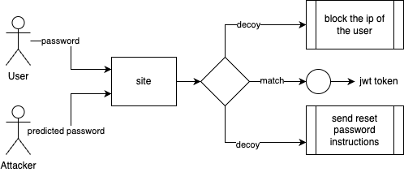

# Experiment 02
## Large Language Models for Password Security Research

## Table of Contents
- [Need](#purpose)
- [Getting Started](#getting-started)
  - [Prerequisites](#prerequisites)
  - [Database Setup](#database)
  - [Running the Project](#running-the-project)
- [Model](#models)
- [Results](#results)

## Purpose

This experiment is to apply the results of experiment 01 which was figuring out the right open source model "Gemma3-12B" and to see the ways to counter attack the attacks on the passwords

1. Generate realistic password variations based on existing password datasets using Gemma3 Model.
2. Integrate with the existing system augmented as JWT based authentication system.
3. Decide a way to protect the password

The insights gained from this experiment can help:
- Improve password security policies
- Develop better password strength metrics
- Understand how attackers might exploit password patterns
- Create more effective password generation guidelines

## Getting Started

### Prerequisites

1. **LM Studio Setup**
   - Download and install LM Studio from [https://lmstudio.ai/](https://lmstudio.ai/)
   - Download the Gemma-3b-12b-it model (approximately 7.33GB)
   - Launch LM Studio and load the Gemma model
   - Start the local server in LM Studio (should run on `localhost:1234`)
2. **Database Setup**
    - Create a Database named: ```nds```
    - Run the ```db/db.py``` to create necessary tables for the experiment.

### Running the Project
1. Clone this repository
2. For Client Interface:
    - Install dependencies: ```npm install```
3. For Server:
    - Navigate into the folder: ```cd server```
    - Install dependencies: ```pip install -r requirements.txt```
3. Run the main script:
   ```bash
    python3 main.py
   ```

## Datasets
- https://www.skullsecurity.org/wiki/Passwords
- https://github.com/yuqian5/PasswordCollection

## Models
- Gemma-3-12b-it ~ 7.33GB

## Results
<div style="background-color:white;">

</div>
